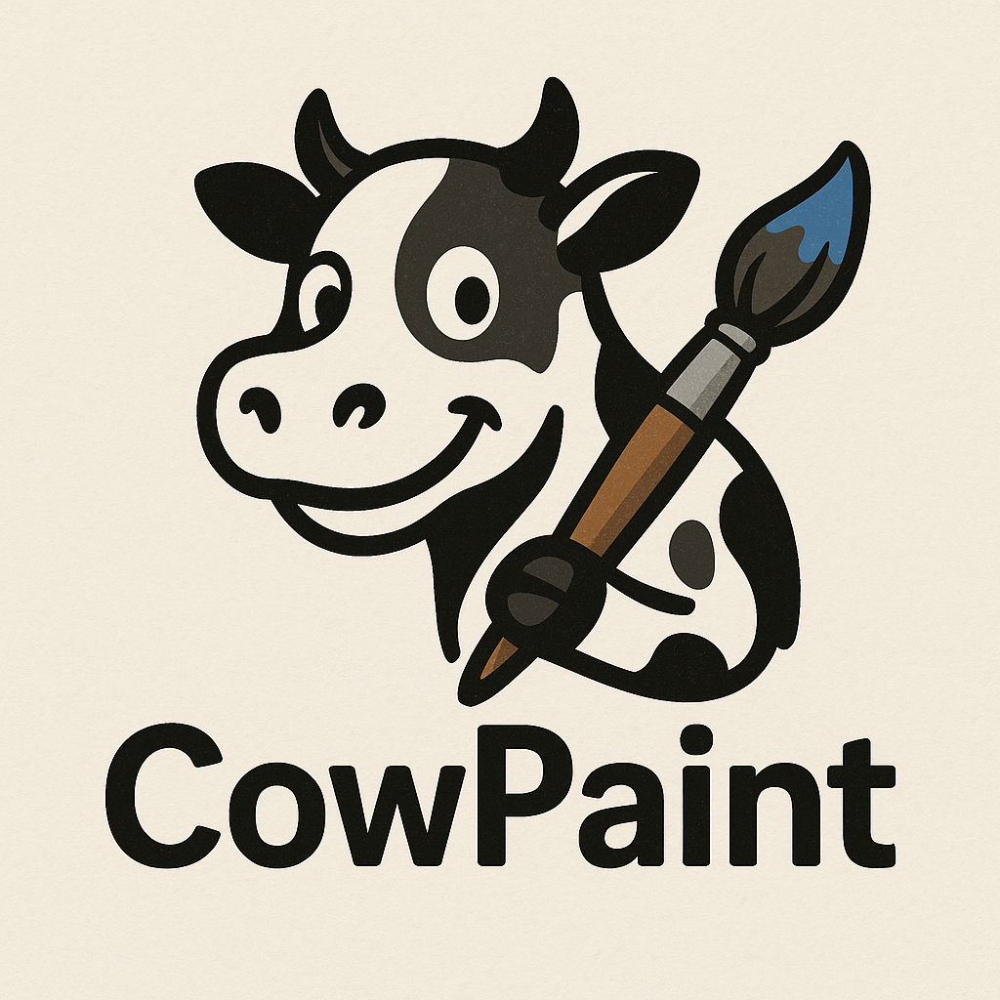

# CowPaint

A simple paint app experiment to learn **Copy-on-Write (CoW) snapshots** inspired by Btrfs.  
Built with [raylib](https://www.raylib.com/) and [nob.h](https://github.com/tsoding/nob.h).



**Keybinds**

- **LMB** — paint
- **C** — clear canvas
- **← / →** — undo / redo
- **+ / −** — brush size
- **S** — show snapshot stats (changed vs reused tiles)
- **X** — toggle blue flash after each stroke (shows which tiles were reused, not copied)

## Copy-on-Write (how it works here)

- **Shared buffers:** Each tile’s pixels live in a refcounted `TileBuf`. Snapshots don’t copy pixel data—they just retain references to the same buffers, so past states and the current canvas share memory until something changes.
- **Copy only when writing:** Before any pixel write, `tile_ensure_unique()` checks the buffer’s refcount. If it’s &gt; 1 (still used by a past snapshot), we allocate a new buffer, copy the pixels into it, and then write to that copy. So we never modify data that a snapshot still needs.
- **Undo/redo = pointer swap:** History stores pointers to tile buffers. Undo/redo just release the current buffers and re-attach the buffers from the chosen snapshot; no bulk copy of the whole canvas.
- **Result:** Only tiles that actually change get copied. Unchanged tiles stay shared across snapshots, which keeps memory and snapshot cost low (similar to Btrfs-style CoW).

## Requirements

### Debian / Ubuntu
```bash
sudo apt-get install -y git gcc pkg-config libraylib-dev
````

### Fedora
```bash
sudo dnf install -y git gcc pkgconf-pkg-config raylib-devel
```


## Build & Run

```bash
# clone
cd CowPaint
# build tool
cc -O2 build.c -o nob

# build app
./nob

# run
./build/cowpaint
```
